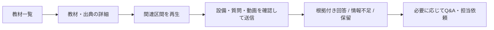
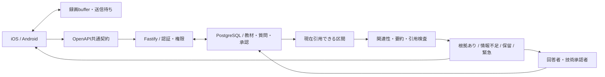

# コウジョー / Kojo

製造現場の技能継承を支える、iOS・Android向けモバイルアプリの開発プロジェクトです。

**English:** A mobile knowledge-transfer project for manufacturing teams, connecting learning materials, camera-based questions, veteran answers, and technical approval.

> 課題・要求・設計・実装・評価を説明するポートフォリオです。本体コードは非公開。2026-10-05の統合基準 `e5f4e8c` を説明し、CI成功と実工場での受入・利用効果を区別しています。

[設計の詳細](docs/architecture.md) · [検証結果](docs/validation.md) · [もう一つのプロジェクト：KantokuAI](https://github.com/Technarra/kantokuai-portfolio)

## 1. Overview

作業員が教材の関連場面を探し、現場の動画を添えて質問し、根拠付きの回答やベテランの知識提供につなぐ構成です。
解決できない質問はQ&A・担当依頼として扱い、人が回答・技術承認した内容を再利用します。
共用端末とiOS・Androidを前提に、同じAPI・契約で質問、素材、承認、再送を管理します。

## 2. Problem — 解決したい課題

現場の知識が個別の会話にとどまると、同じ疑問への対応が繰り返されます。教材があっても、目の前の設備・工程に合う場面を探しにくく、文章だけでは状況を説明しにくいことがあります。

これを、**関連区間へたどり着く、現場を短い映像で伝える、根拠が足りなければ人へつなぐ、承認済みの知識を再利用する**要求に分解しました。技能習得の短縮や質問対応の削減は、実工場で評価する仮説です。

## 3. Target User — 想定ユーザー

| 利用者 | 扱う操作 |
| --- | --- |
| 作業員 | 教材学習、設備・工程に関する質問、動画添付 |
| ベテラン | Q&A回答、コツの共有、知識提供 |
| 技術承認者 | 内容の承認・取消・使用停止 |
| 管理者 | 端末・担当・教材計画の管理 |

共用端末の自己申告名は投稿の記録に使い、個人認証に基づく操作権限とは分けます。

## 4. Key Features — 統合版で扱っている機能

- 教材・出典の閲覧と、関連する動画区間の再生。
- 設備に関する質問と、根拠あり・情報不足・保留・緊急案内の状態。
- 直前30秒の現場映像の保持・選択・質問への添付。
- 音声入力、文字起こしadapter、回答下書き。
- ベテランの回答、技術承認、承認された内容の再利用。
- 本人・端末・接続先に結び付いた送信待ちと再送。
- 制作要望、担当依頼、受信箱、通知adapter。

教材制作の全工程、実AI・実通知、本番運用を完成済みとは扱っていません。

## 5. Screenshots / Demo — 利用の流れ

これは利用フローの模式図です。公開に適した既存の実画面画像・通しデモはまだ確認できていません。実画面の代わりに架空の完成画面を置かず、スクリーンショットと30〜60秒の実機デモを次の課題にしています。

## 6. Architecture — 共通backendと回答経路

端末は入力・撮影・再生・送信待ちを担当し、共通APIが会社・設備・工程、権限、承認、ジョブを扱います。引用可能な資料を選んで回答し、保存済みの回答を読む際も出典の現在の利用可否を再検査します。

Agentは分類・関連性判断・要約・回答下書きを担当します。権限・出典検査・保存・公開確定は通常コードと人の承認の責務です。標準の開発経路はfake providerで、外部LLM adapterはサーバー側で照合した合成資料に限る経路を持ちます。[データの取得・保存・更新](docs/architecture.md)

## 7. Tech Stack — 採用技術と要求の対応

| 技術 | 担当する責務・採用理由の整理 |
| --- | --- |
| SwiftUI / AVFoundation | iOSの状態・撮影・時間範囲の合成・再生を扱う |
| Kotlin / Compose / CameraX / Media3 | Androidの画面、撮影、出典区間の再生を扱う |
| OpenAPI / 生成client | 両OSとAPIのモデル・入出力契約を共有する |
| TypeScript / Fastify | 通信、入出力検証、各業務サービスを分離する |
| PostgreSQL / Kysely | 権限・承認・引用・再送・ジョブをtransactionで保存する |
| PGlite / fake provider | 合成データを使い、外部AIなしで開発・一部試験を再現する |
| Keychain / Android Keystore | 端末資格情報と送信待ちの保護をOSに合わせて扱う |
| Vitest / XCTest / JUnit / GitHub Actions | API・DB・端末policy・契約を異なる境界で検証する |

現在の検索は範囲を限定した文字列ベースの暫定実装です。vector DBや、工場データを自由に外部AIへ送る仕組みとはしていません。

## 8. Technical Challenges — 技術課題と対応

| 課題 | 実装での対応 | 検証・残る制約 |
| --- | --- | --- |
| 根拠がない・停止された内容を回答に使う | 承認済みの引用候補を絞り、出力IDと注意事項を検査。表示時に引用元を再検査 | 合成ケースとDB試験。意味の忠実性・実工場の安全性は別評価 |
| 共用端末の本人切替で下書き・権限が混ざる | 自己申告名と認証権限を分離し、送信待ちをorigin・実本人/端末へ束縛 | 権限・再送・端末policy試験。鍵・失効・運用の設計は継続課題 |
| 録画終了・upload・応答の順序がずれる | 原録画と送信用コピーの所有を分け、冪等key、確定状態、job leaseで管理 | 合成policy・並行DB試験。実機割込・性能・再生は未確認 |

**統合時に実際に直した問題：** Composeで合成評価ファイルが見つからなかったため、Dockerの除外設定に必要な2ファイルだけを許可しました。iOS CIでは署名を無効にすると実Keychain試験が失敗したため、simulatorをadhoc署名し、テストや権限検査を弱めず通過させました。[確認範囲と結果](docs/validation.md)

## 9. Product Decisions — 仕様と設計の判断

| 判断 | 理由と得られること | トレードオフ |
| --- | --- | --- |
| 質問用の直前映像を30秒に限定する | 目の前の状況を伝える範囲と保持量を絞る | 区間境界・音声・後着確定をOSごとに扱う必要 |
| 根拠が不足した回答を保留して人へつなぐ | AI回答を無理に確定せず、ベテランの知識提供と承認へつなぐ | 即時回答できない場合が増える |
| 名前選択と操作権限を分ける | 共用端末でも個人認証・役割・担当範囲を検査する | 切替・失効・PIN・送信待ちの管理が複雑になる |
| 再送は本人が確認できる送信待ちから行う | 別本人への露出・無条件な再送・重複投稿を扱う | 保存失敗とHTTP応答の順序まで考慮する必要 |

## 10. Development Process — 要求から統合・評価まで

要求・設計・API契約・タスク票・決定ログを管理し、AI支援による実装・レビューと人の判断を区別しています。今回の統合では、P2 server・iOS・Androidと依存する契約・計画・UI仕様・CIを専用worktreeで集め、既存変更を保全して検証後にmainへ通常反映しました。

2026-10-05、統合基準 `e5f4e8c` で資料、API単体、PostgreSQL 17移行・並行処理、API契約、Compose起動、iOS simulator XCTest、Android debug build・JVM単体が成功しました。実機・一巡E2E・実AI・実push・本番受入は別の検証対象です。[検証結果](docs/validation.md)

この公開repoの [Issue](https://github.com/Technarra/kojo-portfolio/issues) → branch → commit → [PR](https://github.com/Technarra/kojo-portfolio/pulls) は今回の資料作成の履歴です。非公開本体の開発履歴はコピーしていません。AI支援の有無と、設計・実装・検証の内容を分けて説明します。

本体を含まない資料repoのため、cloneしてアプリを起動する手順はありません。

## 11. What I Learned — 実装・統合から整理した学び

- AIの回答文だけでなく、会社・対象設備・承認状態・引用元を文脈として設計する必要がある。
- 共用端末では、表示する名前、認証した本人、端末、下書きの所有を分ける必要がある。
- 録画・保存・通信・workerは独立して遅れるため、状態・再送・所有の境界が重要になる。
- 合成試験、DB並行試験、simulator試験、実工場の評価は、それぞれ異なる事実を確認する。

実装と統合検証から整理した学びです。導入効果は今後の実工場評価で確認します。

## 12. Future Improvements — 次の検証と改善

1. 公開可能な教材で実画面と30〜60秒の通しデモを記録する。
2. 両端末とAPIをつなぎ、撮影・upload・回答・承認・再利用を一巡で検証する。
3. 実提供先で検索・意味の忠実性・矛盾・適切な保留を評価する。
4. 実機の割込・復帰・容量・性能、実push、保存・削除・バックアップの運用を確認する。

公開物は説明資料です。本体コード、独自プロンプト、完全API契約、資格情報、顧客映像・録音、内部原本・ログ、既存Git履歴は含めていません。ライセンスは未設定です。
