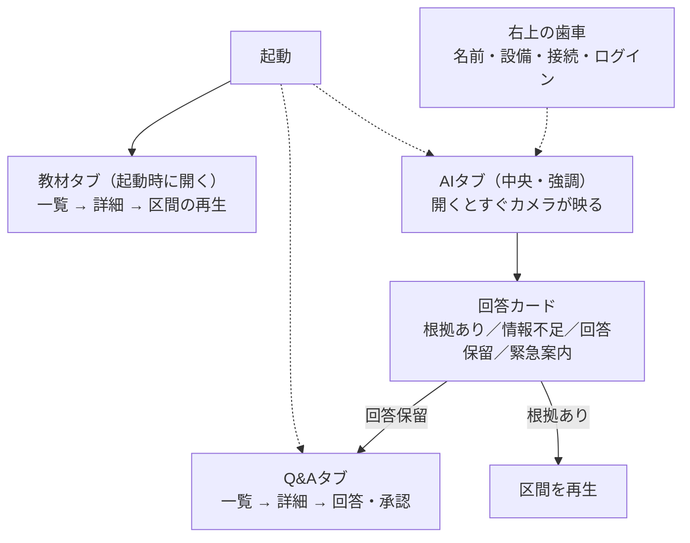
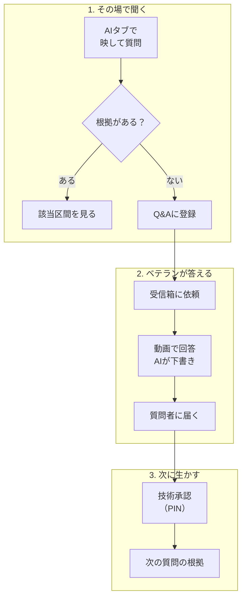

# 04. UXフロー

[READMEへ戻る](../README.md) · 前：[03. 要件](03_system_requirements.md) · 次：[05. アーキテクチャ](05_architecture.md)

## 画面づくりの前提

| 項目 | 決めたこと |
| --- | --- |
| 主な利用者 | 工場の作業員。共用端末、手袋、騒音、立ったまま、片手のことが多い |
| 中心のタスク | 作業中の疑問を、承認済み教材の該当区間ですぐ確かめる |
| 主役の画面部品 | 回答カード（状態と出典の区間） |
| 最優先の操作 | AIに質問する |

方針は「工場でもぱっと見で判断できる、シンプルなデザイン」です。余計な文字を消し、AIのタブを目立たせました。

## 画面構成



- 下部のタブは「教材」「AI」「Q&A」の3つです。AIを中央に置き、ほかより大きく、ブランドの色の円で強調しています。
- 起動時は「教材」タブを開きます。
- 名前・設備・接続などの設定は、右上の歯車から開くシートにまとめました。設定が足りないときも、メイン画面に案内の文は出さず、歯車に警告の印を付けるだけにしています。

## AI画面（質問する）

```text
目的        ：カメラを向けて、写っているものについてすぐ質問する
流れ        ：AIボタン → その場でカメラが起動し、正方形に映像が出る（直近30秒を端末内に保持）
             → 質問を入力（文字・音声）→「質問する」（直近の映像を添付）→ 回答カード
必要な要素  ：正方形のライブ映像と入力欄をひとつにした部品、「質問する」ボタン、右上の歯車
表示しない  ：大きな見出し、開発中の案内、名前・設備の選択、押せない理由の文、撮影用の別画面
```

- 正方形の映像と入力欄を、ひとつの角丸の部品にまとめました。部品全体と「質問する」が、最初の画面に収まる大きさにしています。
- 映像は端末のメモリに直近30秒だけ保持し、古い部分は順に捨てます。「質問する」を押すと、保持している映像を確認なしで添付します。映像がないとき（カメラの権限がない、消した直後など）は文字だけで送ります。
- 映像の左上には「録画中」を常に表示します。止める・再開する・消すボタンは、手袋でも押せる大きさにしています。
- 回答カードや設定を開いたとき、ほかのタブへ移ったとき、画面がロックされたときは、カメラを止めて保持中の映像を捨てます。
- カメラの権限がなくても、文字で質問できます。

## 回答カード

この回答を作業に使ってよいかを、ひと目で判断できるようにしました。

| 状態 | 示すもの | 次の操作 |
| --- | --- | --- |
| 根拠あり | 要約、出典（教材名・時刻）、適用条件と「当てはまりますか」の確認 | 区間を再生 |
| 情報不足 | 足りない情報 | 設備を選ぶ |
| 回答保留 | 答えない理由と、Q&Aに登録したこと | Q&Aを見る |
| 緊急案内 | 固定の緊急案内（回答の最上部に警告の表現で表示） | 連絡先を表示 |

AIの提供元・モデル名や、内部の理由のコードは表示しません。表示のルールは両OSで共通のテストデータにし、単体テストで一致を確かめています。

## 主な利用の流れ



## 現場向けのルール

| ルール | 内容 |
| --- | --- |
| ぱっと見で判断できる | 状態は「アイコンと短い語」と位置で示し、色だけに頼らない。回答の状態は4つの語に固定する |
| 大きく押しやすく | 主要なボタン、PIN、名前の選択は高さ64。それ以外もiOS 44pt／Android 48dp以上。隣り合う操作の間は16以上あける |
| 読める文字 | 状態、回答の要約、主要なボタンは20／太字。本文は15。13は時刻や版などの補足だけに使う |
| 余計な文字を消す | 大きなページタイトル、開発用の表示、常に出る文字数、説明の前置きは出さない |
| 緊急時は例外 | 緊急案内だけは、警告の枠・アイコン・太字で説明文を出す |
| アクセシビリティ | ライト／ダークの両方、文字サイズの拡大、VoiceOver・TalkBack、動きを減らす設定に対応する |

## 共用端末での本人確認

- 名前の選択：名前を大きなボタンで縦に並べ、最近使った名前を先頭にします。名前は記録用で、権限は変わりません。
- PIN入力：4桁の表示と、高さ64のテンキーです。5回失敗したロック中は、残り時間と次にできることを警告の表現で示します。
- 受信箱：個人アカウントだけに表示し、依頼から詳細へ進めます。

## 画面の見直しの記録

| 日付 | きっかけ | 変えたこと |
| --- | --- | --- |
| 2026-10-03 | 工場でもぱっと見で判断できるようにしたい | 余計な文字を消し、AIのタブを強調。AI画面のカメラを正方形にし、入力欄とひとつの部品にした |
| 2026-10-04 | 完成した画面を触って確認 | 撮影は別のシートで開く形にし、名前・設備・接続を歯車の設定に移した。カメラをより大きく見せた |
| 2026-10-04 | 同じ日にもう一度見直し | 撮影用のシートをやめ、AIタブを開くとその場でカメラが起動する形に戻した。映像は直近30秒だけ保持し、質問時に確認なしで添付する。起動時のタブを「教材」にした |
| 2026-10-04 | 両OSの画面のレビュー | タップの領域を44pt／48dp以上にする、PINの警告でテンキーの位置を動かさない、設定の並びを「現場 → 管理 → 接続」にする、などの直し方を決めた |
