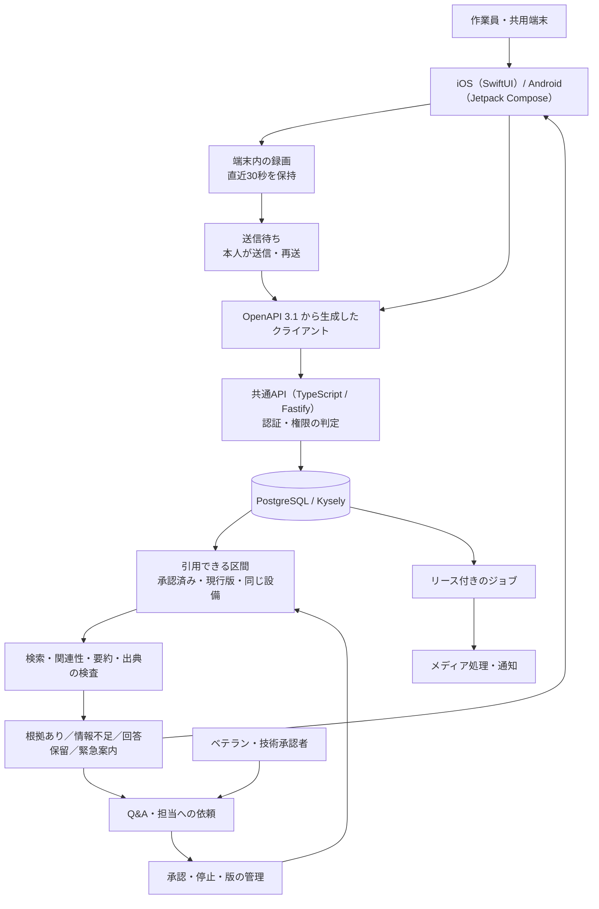
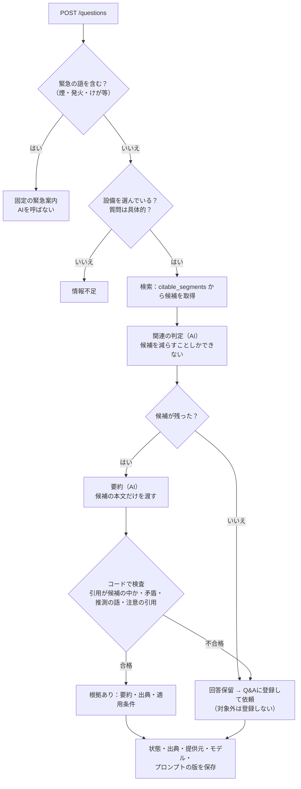

# 05. アーキテクチャ

[READMEへ戻る](../README.md) · 前：[04. UXフロー](04_ux_flow.md) · 次：[06. テスト](06_testing.md)

2026年10月時点の統合版（Phase 2まで）の構成です。プロンプトの全文と本体のコードは載せていません。

## 全体構成



```text
apps/ios            SwiftUI。共用端末モードと個人アカウントモードを同じアプリで切り替える
apps/android        Kotlin・Jetpack Compose。同上
services/api        TypeScript。HTTP APIとジョブのワーカーを、同じコードベースの別プロセスで起動
packages/contracts  OpenAPI 3.1と、両OSで共有するテストデータ
infra/compose       Docker Compose（工場内のPC・開発・CIで同じ定義）
tests/eval          AI回答の評価セット
```

## 構成の判断と理由

| 判断 | 理由 |
| --- | --- |
| APIとワーカーを1つのリポジトリ・別プロセスにする | 工場内のPC1台で動かし、運用する部品を増やさないため |
| ジョブの待ち行列をPostgreSQLに置く | 追加のミドルウェアを置かずに済むため |
| 検索の索引もPostgreSQLに置く | 自前で運用するので拡張機能を選べるため。日本語の検索方式は技術検証で決める |
| メディアの保存部品を差し替えられるようにする | 工場内ではローカルのボリューム、クラウドではS3互換を使うため |
| 両OSは同じOpenAPIの契約から生成したクライアントを使う | APIとアプリの食い違いを、テストで検出するため |

## サーバー（services/api）

```text
src/
  http/        ルーティング、契約の検証、エラー（application/problem+json）
  auth/        端末トークン、個人アカウント、PINによる昇格トークン、権限の判定
  materials/   教材の計画、版、区間、制作の要望
  qa/          質問、ベテランの回答、依頼、受信箱
  approval/    技術承認、取り消し、使用停止と解除
  answer/      回答の判定（下の「回答の判定」）
  media/       アップロード、保存、再生URL、取り込みのジョブ
  ai/          AI接続部品の境界と各提供元の実装、外部送信の許可リスト
  audit/       監査記録
  jobs/        ワーカー（文字起こし、索引、通知、容量の監視）
```

依存の向きは `http` → 各業務モジュール → `auth`・`audit`・`ai`（境界）です。業務のモジュールは、AI提供元の実装に依存しません。

APIの共通ルール：

| 項目 | 内容 |
| --- | --- |
| 認証 | `Authorization: Bearer`。共用端末は端末トークン、個人は個人アカウントのセッション |
| 権限操作 | PINの確認で発行した、5分だけ有効な昇格トークンを付ける |
| 自己申告の名前 | 記録用のヘッダーで送る。権限には使わない |
| 冪等性 | 作成系は `Idempotency-Key` が必須。同じキーの再送には同じ結果を返す |
| エラー | `application/problem+json`。安定したエラーコードを返す |

権限の判定は `authorize(actor, permission, scope)` の1つの関数に集め、すべての変更系APIが通ります。テストは「利用者の種類 × 操作 × 範囲の内外 × 昇格の有無」の表で網羅します。

## データ

主なテーブルは、名簿（`operators`）、端末（`devices`）、範囲付きの権限（`grants`）、教材の計画と版（`material_plans`・`material_versions`）、区間（`segments`）、質問と回答の結果（`questions`・`answer_results`）、ベテランの回答、コツ、承認、停止、依頼、メディア、監査（`audit_events`、追記のみ）です。

**引用できる区間は、SQLのビュー `citable_segments` として1か所で定義しています。** 検索・再生URLの発行・要約後の検証のすべてがこのビューを使い、承認・停止・版の状態をアプリ側で重複して判定しません。`answer_results` には、回答の状態・出典に加えて、AIの提供元・モデル・プロンプトの版を記録し、あとから再現できるようにしています。

## 回答の判定



- AIには、関連の判定と要約だけを任せます。権限、引用してよいかの判定、保存、技術承認は通常のコードと人が担当します。
- 安全はプロンプトではなく、要約の後の決定的な検査で担保します。注意の区間を引用し忘れた場合は1回だけ要約し直し、それでも欠けていれば注意の原文を添えます。
- 区間の本文はデータとして区切って渡し、質問文に含まれる指示には従わないようにしています。
- 現在の検索は、正規化した2文字の一致による暫定の方式です（最大2000区間から5出典・12区間）。日本語の検索方式は技術検証で決めます。

AI接続部品はインターフェースで分け、提供元を差し替えられます。

```ts
interface RelevanceJudge { filter(q: string, c: Candidate[]): Promise<{ keep: string[]; offTopic: boolean }> }
interface Summarizer     { summarize(q: string, c: Candidate[]): Promise<{ summary: string; cited: string[]; conflict: boolean }> }
```

標準の開発経路は、外部と通信しない決定的な偽の実装（fixture）です。外部AI（開発中はClaude Sonnet 5.5）は明示的に設定したときだけ使い、合成データかどうかをサーバーの許可リストで確かめてから送ります。

## メディア

| 項目 | 方針 |
| --- | --- |
| 形式 | MP4。サーバーで再生しやすい形に整える。HLSは使わない |
| アップロード | 受付を作ってから本体を送る。途中で失敗したら、同じ受付IDで送り直す |
| 再生 | 短時間だけ有効な署名付きURLを返す。発行のたびに、引用してよいか・閲覧できるかを確かめ直す |
| 区間の再生 | 指定した開始時刻へ正確に移動する |
| 容量 | 保存先の空き容量をジョブで監視し、少なくなったら管理者の受信箱へ警告する |

## モバイルアプリ

| 項目 | iOS | Android |
| --- | --- | --- |
| UI | SwiftUI | Jetpack Compose |
| 状態管理 | Observation（`@Observable`）の画面モデル | ViewModelとStateFlow |
| APIクライアント | swift-openapi-generator | 生成したクライアント（Retrofit / kotlinx.serialization） |
| 動画 | AVFoundation（録画）、AVPlayer | CameraX、Media3 |
| 安全な保存 | Keychain | Android Keystore（AES-GCM）とAtomicFile |
| 最低OS | iOS 26 | API 31（暫定） |

- 会社支給の端末でOSを選べるため、最低OSは新しめにし、古い端末向けの代わりの実装は持たない方針です。
- 回答カードの4状態の表示ルールと、録画の状態の移り変わりは共通のJSONのテストデータに定義し、両OSの単体テストで同じデータを読みます。機能は両OSの変更がそろったときに完了とします。

## 文脈の取得・保存・更新

回答の文脈は、会社・設備・工程・承認の状態と、利用者が今回送る内容から組み立てます。個人に関する記憶を横断的に集める構成ではありません。

| 文脈 | 取得する時点 | 保存先 | 更新・利用の扱い |
| --- | --- | --- | --- |
| 教材と動画の区間 | 教材の登録・処理・技術承認 | PostgreSQLの資料・版・区間・承認 | 回答のたびに、会社・設備・工程と最新の承認状態で選ぶ。停止・取り消し・改版は引用の可否に反映する |
| 質問と結果 | 利用者が確認して送信したとき | PostgreSQLの質問・結果・引用ID・監査 | 冪等キーで再送を扱い、表示のたびに引用元を確かめ直す |
| 直近の現場の映像 | AI画面のカメラ | 端末のメモリ（直近30秒） | 質問に添付した分だけを送信用のコピーとして残す |
| 送信待ち | 投稿やアップロードの前 | iOSは保護付きの領域、AndroidはKeystoreで暗号化 | 接続先と本人・端末に結び付ける。再起動時の送信中は送信待ちに戻し、今の本人が再送する |
| 認証・操作する人 | 端末の登録、個人のログイン、権限操作 | Keychain／Keystoreと、サーバーのセッション・権限 | 自己申告の名前は監査用。送信待ちにパスワード・PIN・個人のセッションを保存しない |
| 今回のAIへの要求 | 質問を受け付けた後 | 処理中の要求と、結果の引用ID・提供元・モデル・プロンプトの版 | 元の録画や資格情報をAIに渡さない |

たとえば、技術承認された回答が後で使用停止になった場合、過去に保存した回答をそのまま信じず、読み出すときに引用元の今の状態を確かめます。共用端末で別の人に切り替えた場合も、前の人の送信待ちを、今の人へ無条件に見せたり再送したりしないよう、持ち主を照合します。

## 運用

| 項目 | 方針 |
| --- | --- |
| 起動 | Docker Composeで api・worker・postgres を起動する。工場内のPCでもクラウド（東京リージョン）でも同じ構成 |
| 秘密情報 | 外部AIのAPIキーや署名鍵は環境変数で渡し、Gitと端末に置かない |
| ログ | 構造化ログ。質問の本文・動画・ヘッダー・資格情報は出さない |
| 監視 | ヘルスチェック、ジョブの失敗数、空き容量 |
