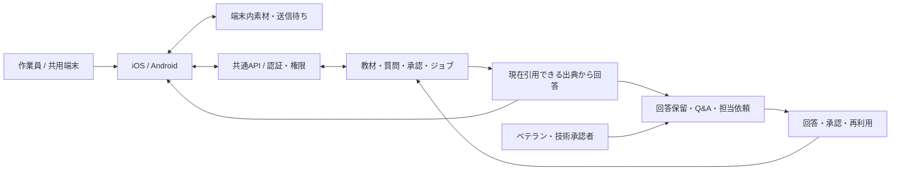
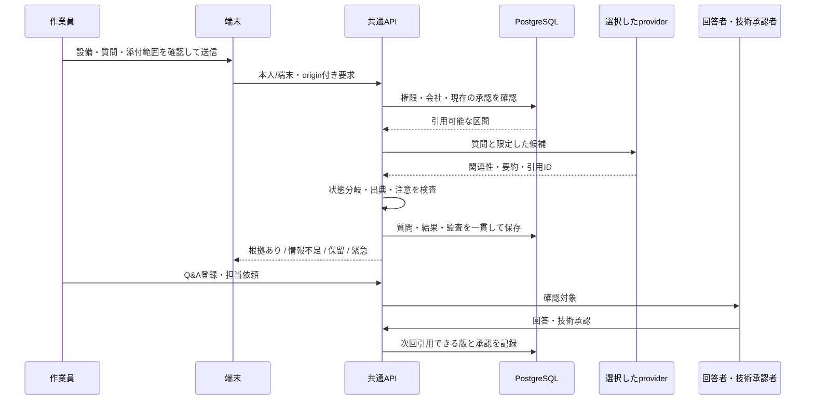

# コウジョー / Kojo — Architecture

[READMEへ戻る](../README.md)

2026-10-05に確認した実装を基準に、Agentの処理とデータの責務を説明します。全文プロンプト・API契約・本体コードは公開対象に含みません。

## 概要構成

現場の素材と質問を受け付け、引用可能な出典を使う回答処理につなぎます。根拠が不足する場合は保留や担当確認へ進め、技術承認された回答を次の出典として使える構成です。質問・回答・監査の保存、media処理、非同期ジョブを共通APIに置いています。

## Agentが何を受け取り、どう処理するか

Agentの責務は、質問・共有内容の分類、引用候補の関連性判断、出典付き要約、回答下書きです。権限、引用可能性、保存、media upload、技術承認を行うのはAPIと端末のコードです。標準の開発経路はfixture・抽出型のfake providerで、外部LLMを呼ばずに境界と失敗条件を確認できます。Anthropic adapterは別経路にあり、サーバー側で照合した合成資料のみを外部送信の対象にしています。

| 段階 | 入力と処理 | 出力・人の判断 |
| --- | --- | --- |
| 入力の目的を整理する | 文、動画添付の有無、質問・回答・コツの画面contextを分類処理に渡す | 質問・コツ・不明。分類だけで投稿や公開を確定しない |
| 質問を受け付ける | 認証した会社・本人/端末の範囲で、設備・工程・素材を確認する | 情報不足や緊急案内への分岐。緊急の分岐では検索やAIを呼ばない |
| 根拠を選ぶ | 現在引用可能な、承認済み最新資料の区間を設備・工程で絞り、文字列に基づく暫定検索を行う | ID付きの引用候補。vector DBや全社横断の自由検索ではない |
| 回答案を作る | 関連性・矛盾の判断と、候補内の出典を使う要約をproviderへ依頼する | 根拠あり・情報不足・保留・緊急の結果。出典ID、出力構造、注意の引用をコード側で検査し、必要な限定再試行を行う |
| ベテランへつなぐ | 利用者がQ&Aへ登録・担当依頼する。回答者は内容と必要な下書きを確認する | 人の回答と技術承認を経て、再利用可能な出典になる |

回答は質問・結果・Q&A・監査等の関係をtransactionで保存し、同じ送信keyの再送は元の処理を確認します。結果を読み直す際にも、引用元が現在利用できるかを再検査します。通信失敗は本人が確認できる送信待ちへ戻し、DB workerの長い処理はlease・試行状態で管理します。録画確定、HTTP応答、保存が別々に遅れる条件も端末policyで扱います。

## コンテキストの取得・保存・更新

回答文脈は、会社・設備・工程・承認状態と、利用者が今回送る内容から組み立てます。KantokuAIのような個人向けの永続メモリを横断的に収集する構成ではありません。

| 文脈 | 取得する時点・取得元 | 保存先・対応する単位 | 利用期間・更新の扱い |
| --- | --- | --- | --- |
| 教材と動画区間 | 教材登録・処理・技術承認で取得した本文、注意、時間範囲 | PostgreSQLの資料・版・区間・承認とmedia記録 | 回答時に会社・設備・工程と最新の承認状態で選択。停止・承認取消・版変更は引用可能性に反映する |
| 質問と結果 | 利用者が確認して送信した文、設備/工程、添付ID | PostgreSQLの質問・結果・引用ID・provider情報・監査 | 冪等keyで再送を扱い、表示時にも引用元を再検査。運用上の保持期間・削除方針は未確定 |
| 最近の現場映像 | 録画条件を満たすAI画面でカメラから取得。質問には直前30秒の範囲を使う | 端末のprivate録画領域と、一時的な区間管理 | 端末内のbufferと、確認して送るコピーを分ける。復帰後に原録画がすべて復元されるとはしていない |
| 送信待ち | 投稿や素材uploadの前に要求と送信用コピーを確定 | iOSはApplication Supportの保護付きAtomic保存、AndroidはKeystoreを用いた暗号化Atomic保存 | origin・実本人/端末に結び付ける。再起動時の送信中は待ちへ戻し、現在の本人による再送へつなぐ |
| 認証・操作主体 | 端末登録、個人ログイン、権限操作で取得 | iOS Keychain / Android Keystoreと、サーバーのsession・権限記録 | 自己申告名は監査用で権限を付けない。送信待ちにはpassword・PIN・個人sessionを保存しない |
| 今回のAI要求 | 質問受付後に、利用可能な区間と質問を選択 | 処理中の要求、結果の引用ID・provider/model/prompt版の記録 | providerへ原録画や資格情報を自由に渡さない。標準はfake、外部adapterは合成資料の照合を経る |
| 非同期処理 | media処理等の要求をジョブとして登録 | PostgreSQLの状態・試行・lease情報、media保存先 | 古いworkerの結果更新をtokenで抑制。保存容量・本番media保持・S3運用は継続課題 |

たとえば、ある教材の回答が技術承認された後に使用停止になった場合、過去に保存した回答だけを信じず、読み出し時に引用元の現在の状態を確認する構成です。また、共用端末で別の人へ切り替えた場合、前の本人の送信待ちを現在の本人へ無条件に公開・再送しないよう所有を照合します。これらの仕組みは、実工場での安全性やすべての保持・削除経路の保証を意味しません。
